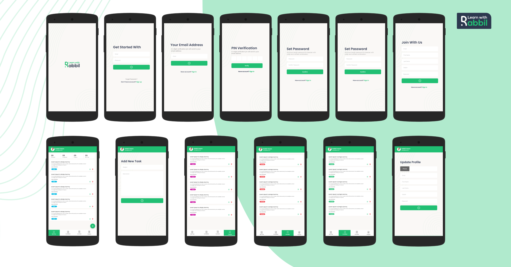

# tm_app_rest_api

A new Flutter project.

## Getting Started

=> Understand Project FLow 

=> ------------Rest Api

=> arrange Flutter project Structure

=> Develop feature on by one 

https://pub.dev/packages/flutter_svg 

https://pub.dev/packages/http 

https://pub.dev/packages/fluttertoast 

https://pub.dev/packages/pin_code_fields

project UI: 

